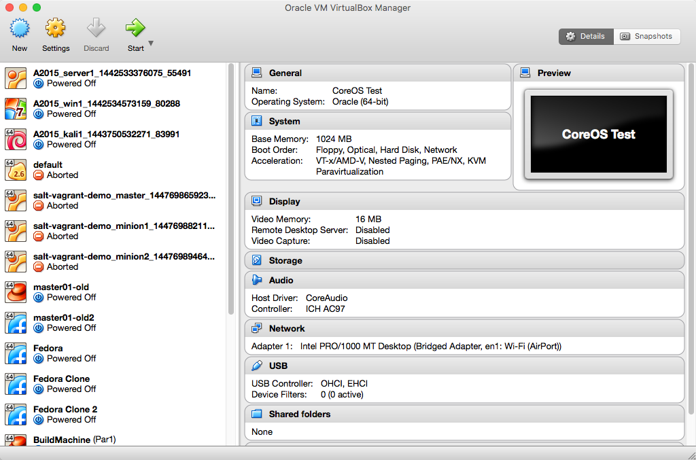

# CR340

###Systèmes d'exploitation

### Cours 1 - Intro

---

# Qui suis-je

--

## Patrick Lécuyer

 VP Architecure Sécurité - IaaS et PaaS - Morgan Stanley

18 ans d'expérience en TI dans différentes industries

- Cirque du Soleil
- Domtar
- Banque Nationale
- Banque Laurentienne
- Valeurs Mobilières Desjardins

--
##Comment me rejoindre?

Après le cours: 15 minutes

Par courriel: [patrick.lecuyer@polymtl.ca](mailto:patrick.lecuyer@polymtl.ca) - Prevoir 48 heures

Slack: [cr340.slack.com](https://cr340.slack.com)

Twitter: [@patricklecuyer](https://twitter.com/patricklecuyer)

LinkedIn: https://ca.linkedin.com/in/patricklecuyer

---
# Le cours
--
## Objectifs
* Identifier les différents composants d'un système d'exploitation et en comprendre le rôle
* Comprendre les attaques fréquentes sur les systèmes d'exploitation
* Comprendre les mécanismes de défense inclus dans les systèmes d'exploitation modernes
--
## Structure

|Cours|Contenu|
|-----|-------|
|1-2| Introduction et mise à niveau|
|3-8| Composantes dy système d'exploitation|
|9-11| Sécurisation des systèmes d'exploitation|
|12| Technologies emergentes|
|13| Révision|
--
# Evaluations

--
## Devoirs
3 courts quiz à choix de réponse, donné 1 semaine avant la date de remise.  Ces devoirs correspondent aux sections importantes du cours

|Quiz|Date|
|-----|-------|
|1| 17 septembre|
|2| 17 octobre|
|3| 14 novembre|
--
## Travail de session

Travail pratique à développement lié au laboratoire.

**Présentation du travail**: 3 octobre

**Date de remise**: 5 décembre

*Note:  Date sujette à changement dépendant de l'évolution de la session *
--
#Laboratoires
--
##Laboratoires
L
---
# Outils
--
## Moodle

Site standard Moodle de Polytechnique. Ce site sera utilisé pour les devoirs, les remises de laboratoires, l'accès a via et l'accès aux fichiers du cours.  Une version PDF des notes de cours sera aussi disponible pour chaque scéance de cours.

--
## Notes en ligne
Une version interactive des notes de cours peut être trouvées en tout temps sur cr340.patl.io.
--
## Slack

Plateforme de communication et de collaboration.

Cette plateforme sera utilisée en remplacement des forums Moodle dans le cadre de ce cours.

Inscription:  slack.cr340.patl.io

Accès: cr340.slack.com
--
#Demo Slack
--
##Vagrant + Virtualbox
Vagrant est un outil pour construire et distribuer des environnements virtualisés reproductibles.  Cet outil sera utilisé pour distribuer les environnements de laboratoire utilisés dans le cadre du cours.

 Vagrant requiert que l'hyperviseur Virtualbox soit présent sur le système
--
## Installation de virtualbox
1. Télécharger la dernière version de Virtualbox sur https://www.virtualbox.org/wiki/Downloads
2. Installer Virtualbox sur votre système.  Ceci demandera un redémarrage.
3. Assurez-vous que Virtualbox démarre bien:

--
## Installation de Vagrant
1. Téléchargez Vagrant sur www.vagrantup.com
2. Installez Vagrant sur votre système
3. Pour les utilisateurs **Windows** seulement, télécharger le fichier ssh.zip du site [Moodle](http://moodle.polymtl.ca) et extraire son contenu dans le répertoire `C:\Hasicorp\vagrant\bin`
4. Créez un répertoire pour le laboratoire du Cours 1.  Un nouveau répertoire devra être créé pour chaque cours contenant un laboratoire
5. Téléchargez le fichier Vagrantfile dans la section Cours 1 du site Moodle du cours et déposez-le dans ce répertoire

--
## Essais
3. Ouvrez une session ligne de commande et naviguer vers ce répertoire
4. Entrez la commande `vagrant up`
5. La machine virtuelle devrais être téléchargée et démarrer
6. Entrez la commande `vagrant ssh` pour ouvrir une session vers la machine virtuelle
7. Fermez la session avec la commande `exit`
8. Détruisez la machine virtuelle avec la commande `vagrant destroy`

--
#Demo Vagrant + Virtualbox
--
##Commandes Vagrant utiles
- `vagrant up`: démarrez les machines virtuelles
- `vagrant ssh [nom]`: Ouvre une session vers la machine \[nom\]
- `vagrant destroy`: Détruis les machines virtuelles
- `vagrant suspend`: Interrompt l'exécution des machines virtuelles sans les détruire
---
# Concepts de base
--
##Definition
>Un système d'exploitation est un ensemble de programmes qui dirige l'utilisation des capacités d'un ordinateur par des logiciels applicatifs. Il reçoit des demandes d'utilisation des capacités de l'ordinateur de la part des logiciels applicatifs. Le système d'exploitation accepte ou refuse ces demandes, puis réserve les ressources en question pour éviter que leur utilisation n'interfère avec d'autres demandes provenant d'autres logiciels.
--
# Historique
--
## Les années 70

--
## Les années 80
--
## Les années 90
--
## Les années 2000
--
## Les années 2010
