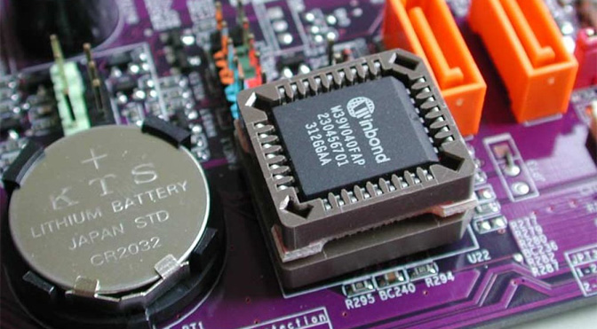

# CR340

###Systèmes d'exploitation

### Cours 3 - Le démarrage du système

---
# Concepts - Composantes matérielles
--
# BIOS

Le BIOS (Basic Input/Output System) est une composante matérielle qui sert d'interface entre le processeur et le matériel de l'ordinateur.  Le BIOS inclus un environnement d'exécution qui s'

--
# BIOS


--
# Processeur

Le processeur
--
## Registre

Les registres sont des
---
# Concepts - Langage assembleur
--
## Instructions
--
## Pile (Stack)
--


--
# Le démarrage
--
## Étapes du démarrage

* L'ordinateur initialise le BIOS
* Le BIOS démarre le processus de vérification matériel (POST)
* En utilisant l'order configuré dans le BIOS, l'ordinateur lit les 512 premier octets de chacun des disques
* Si les deux dernier octets d'un disque sont `Ox55 0xAA`, le disque est considéré démarrable.
* Si le disque est démarrable, le premier secteur du disque est copié en mémoire à l'addresse `0x7C00`
* Le BIOS transfert le contrôle au code contenu dans le secteur (`jmp 7c00h`)

---
# Le bootloader
--
## Initialization de la pile
```x86asm
mov ax, 07C0h   ; Set 'ax' equal to the location of this bootloader divided by 16
add ax, 20h     ; Skip over the size of the bootloader divided by 16
mov ss, ax      ; Set 'ss' to this location (the beginning of our stack region)
mov sp, 4096    ; Set 'ss:sp' to the top of our 4K stack
mov ax, 07C0h   ; Set 'ax' equal to the location of this bootloader divided by 16
mov ds, ax      ; Set 'ds' to the this location
```
--
## Fonction d'impression
```x86asm
print:
	mov ah, 0Eh     ; Specify 'int 10h' 'teletype output' function
	                ; [AL = Character, BH = Page Number, BL = Colour (in graphics mode)]
.printchar:
	lodsb           ; Load byte at address SI into AL, and increment SI
	cmp al, 0
	je .done        ; If the character is zero (NUL), stop writing the string
	int 10h         ; Otherwise, print the character via 'int 10h'
	jmp .printchar  ; Repeat for the next character
.done:
	ret
```
--
## Appel de fonction
```x86asm
mov si, message ; Put address of the null-terminated string to output into 'si'
call print      ; Call our string-printing routine
cli             ; Clear the Interrupt Flag (disable external interrupts)
hlt
```
--
## Signature de démarrage
```x86asm
times 510-($-$$) db 0
dw 0xAA55	
