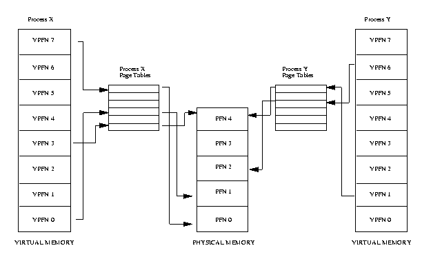

# CR340

###Systèmes d'exploitation

### Cours 5 - Le noyau (suite)
---
# Les tuyaux (*pipes*)
--
## Qu'est-ce qu'un tuyau

Un tuyau est, à la base, un mécanisme de communication interprocessus. Il permet donc à deux processus distincts de communiquer de l’information.

Un tuyau est un mécanisme à sens unique, les données peuvent donc être communiquées d’un processus source vers un processus de destination.  Les communications dans le sens inverse sont impossibles.
--
## Posix - Files d'attente

Dans le monde Posix, un tuyau est un mécanisme de communication basé sur le processus de file d’attente unique (queue).

Ceci signifie que les données qui entrent dans le tuyau vont sortir dans leur ordre d’entrée.  Le processus cible ne peut demander une donnée en particulier et il n’est pas possible de prioriser certaines données.

Ce type de file d’attente est souvent appelé FIFO pour First In First Out.
--
## Powershell - Objets

Dans le monde Powershell, au lieu de files d’attente classique, les tuyaux communiquent des objets entiers.
Cette façon de fonctionner est plus versatile que les tuyaux Posix car l’information est reçue de manière structurée et il est donc plus facile de l’utiliser et la manipuler.

--
## Types de tuyaux

Il existe deux types de tuyaux principaux:

* **Tuyau direct**:  Ce tuyau est utilisé à l’intérieur même d’une ligne
* **Tuyau nommé**:  Ce type de tuyaux est disponible seulement sur les systèmes compatibles Posix.  Ces tuyaux possèdent un nom et peuvent être utilisés par deux commandes invoquées séparément.
--
## Tuyau direct

Il est important de noter que ce type de tuyaux affecte seulement le descripteur STDOUT et non le descripteur STDERR.

Exemple:  `ps –ef | grep bash`

Dans le monde Powershell, le tuyau direct permet d’utiliser un objet ou une collection d’objets sortant d’une commande comme entrée à une autre commande.

Exemple:  `Get-Process | Select-Object name`
--
## Tuyau direct

Un tuyau direct est indiqué à l’intérieur d’une ligne de commande par l’utilisation du caractère |.
Dans le monde Posix, ce type de tuyaux permet de lier le descripteur STDOUT d’une commande source au descripteur STDIN d’une commande destination.
De cette manière, les données en sortie d’une commande sont utilisées comme entrée pour une autre.
--
## Tuyau nommé

Le standard Posix permet de définir des tuyaux nommés à l’aide de la commande mkfifo
Cette commande crée un fichier spécial sur le disque ayant les propriétés d’une file d’attente FIFIO.
Ainsi, toute donnée envoyée au tuyau restera présente tant qu’un autre processus n’aura pas lu son contenu.  Aussitôt le contenu lu, il n’est plus disponible dans le tuyau.
Un tuyau nommé peut être effacé comme un fichier régulier en utilisant la commande rm.
---
#Interfaces de communications (*sockets*)
--
## Qu'es-ce qu'une interface de communication?

* Une interface de communication (*socket*) est un type de descripteur qui permet à deux processus de communiquer à travers un réseau.

* Bien que de nombreuses technologies réseau et de nombreux types d’interfaces de connexion existent, ce cours couvrira seulement les interfaces de communication IP.
--
## Interface de communication d'écoute

Une interface de communication d’écoute attend qu’un processus distant se connecte à l’interface.  Tant qu’aucun processus ne s’est connecté, l’interface n’est pas active et il n’est possible ni de recevoir ni de transmettre des données sur l’interface.  Une interface de communication d’écoute est créée pour répondre sur un port (numéro de 1 à 65535) pour une adresse IP locale donnée.
--
## Interface de communication de connexion

* Une interface de communication de connexion permet de connecter à une interface d’écoute préexistante.  Tant que la requête de connexion d’une interface de communication de connexion n’est pas acceptée par une interface d’écoute, il n’est possible ni de recevoir ni de transmettre des données sur l’interface. L’interface est configurée pour se connecter à un port particulier sur une adresse IP distante donnée.
--
## Fonctionnement

Le descripteur d’une interface de communication est composé de deux files d’attente de types FIFO:

* La file d’attente d’envois:  Cette file d’attente est utilisée pour envoyer des données vers le processus connecté à l’interface
* La file d’attente de réception:  Cette file d’attente est utilisée pour recevoir des données du processus distant.

Le descripteur d’une interface de communication est considéré comme bidirectionnel, c’est-à-dire qu’il est possible à la fois de lire et d’écrire dans ce descripteur en parallèle.

---
# La gestion de la mémoire virtuelle
--
## Mémoire virtuelle

La mémoire virtuelle est une couche d'abstraction créée par le système d'exploitation entre les processus et la mémoire physique de l'ordinateur.  La mémoire virtuelle permet d'abstraire la localisation physique de l'espace mémoire d'un processus, empêchant ainsi les processus d'interragir directement.  Le mémoire virtuelle est aussi utlisé pour étendre la capacité de mémoire vive de l'ordinateur au-dela de ses limites physiques.
--
## Mémoire virtuelle


Source: http://www.tldp.org/LDP/tlk/mm/memory.html
--
## *Mapping*
Lors de l'exécution d'une image binaire, les pages de mémoire virtuelles représentant le code a éxécuter ne sont pas directement importées en mémoire.  Ces pages sont plutôt pointées vers l'image binaire sur disque.  Lors de l'accès d'une des pages mémoire, le gestionnaire de mémoire virtuelle transfert la page en question du disque vers la mémoire.
--
## *Swapping*
Le concept de *swap* permet d'étendre la quantité de mémoire vive disponible.  Lorsque qu'une page mémoire n'a pas été utilisée depuis un certain temps, la page est écrite sur le disque dur et effacée de la mémoire.  L'algorithme exact pour choisir les pages a envoyer au disque dépendent du système d'exploitation.

Le *swap* a un impact sur la performance.  Si la mémoire physique est trop petites pour accomoder les processus actif, le phénomène de *trashing* peux se produire.


---
# *Userspace* vs *Kernelspace*
--
## *Userspace* vs *Kernelspace*

L'accès à la mémoire est au périphériques dans un mode POSIX est séparé en deux espaces: *kernelspace* pour les processus reliés au noyau et *userspace* pour les processus utilisateur.
--
## Processus **kernelspace**

Les processus kernelspace sont considéré comme privilégiés et ont accés directement à la mémoire et aux différents périphériques.  Ces processus sont initiés directement par le noyaux et incluent les différents modules du noyaux ainsi que les pilotes de matériel.
--
## Processus **userspace**

Les processus userspace sont les processus normaux, démarré par les utilisateurs.  Ces processus doivent transiger par le noyau pour accéder la mémoire est les différents périphériques.
---
# Les appels système
--
Un appel système est une méthode pour un processus *userspace* de faire une demande au noyau pour une resource gérée par celui-ci.  Les appels système sont donc la principale méthode pour un processus d'intéragir avec le système d'exploitation.
--
## Appels systèmes - Système de fichier
```
creat()
open()
close()
read()
write()
lseek()
dup()
link()
unlink()
stat()
fstat()
access()
chmod()
chown()
umask()
ioctl()
```
--
## Appels système - Processus
```
exec()
fork()
wait()
exit()
getuid()
geteuid()
getgid()
getegid()
getpid()
getppid()
signal()
kill()
alarm()
chdir()
```
--
## Appels système - Communication interprocessus
```
pipe()
msgget()
msgsnd()
msgrcv()
msgctl()
semget()
semop()
shmget()
shmat()
shmdt()
```
--
## Exemple d'utilisation: Fork()
```c
#include  <stdio.h>
#include  <string.h>
#include  <sys/types.h>

#define   MAX_COUNT  200
#define   BUF_SIZE   100

void  main(void)
{
     pid_t  pid;
     int    i;
     char   buf[BUF_SIZE];

     fork();
     pid = getpid();
     for (i = 1; i <= MAX_COUNT; i++) {
          sprintf(buf, "This line is from pid %d, value = %d\n", pid, i);
          write(1, buf, strlen(buf));
     }
}
```
--
## Exemple d'utilisation - Fork Bomb
```c
void  main(void)
{
    while (1){
     fork();
     sleep(1);
     }
}
```
--
## Suivre les processus système

La commande `strace` permet de suivre les apels systèmes invoqués par un processus.  Cette commande est utile pour mieux comprendre l'intéraction entre différents processus et le système d'exploitation.
