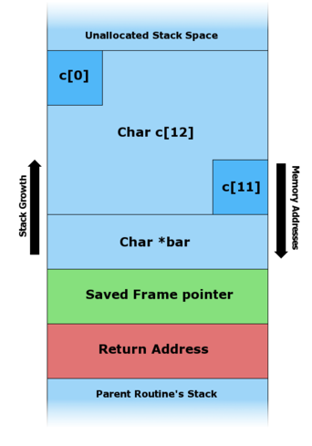
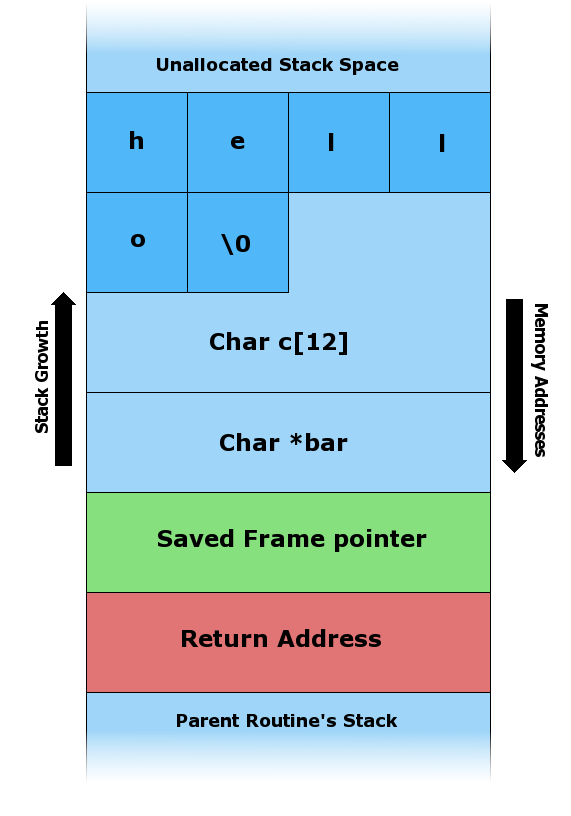
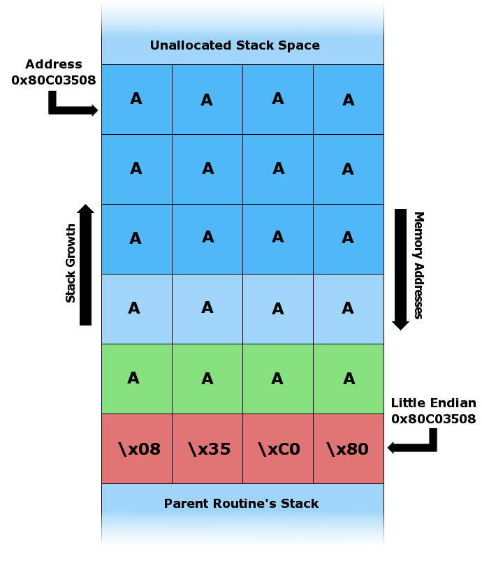
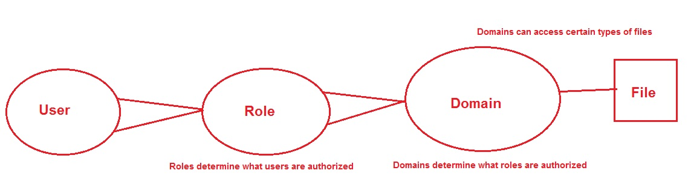

# CR340

###Systèmes d'exploitation

### Cours 8 - Fonctions de sécurité du système d'exploitation
---
# Address Space Layout Randomization (ASLR)
--
## Qu'est-ce que l'ASLR

L'*ASLR* (*Address Space Layout Randomization*) est une fonctionalité de sécurité du noyau de système d'exploitation qui assigne aléatoirement la position des différentes section mémoire d'une image exécutable (code, pile, *heap*, etc.) à l'intérieur de l'espace mémoire qui à été assigné à un processus.
--
## Comment l'ASLR protége?
L'ASLR protège principalement contre les attaques par dépassement de pile en empêchant l'attaquant de connaitre l'addresse de retour a utiliser.
--
## Attaque par dépassement de pile
```C
#include <string.h>

void foo (char *bar)
{
   char  c[12];

   strcpy(c, bar);  // no bounds checking
}

int main (int argc, char **argv)
{
   foo(argv[1]);
}
```
--


(Source: Wikipedia)
--


(Source: Wikipedia)
--


(Source: Wikipedia)
--
## Faiblesses d'ASLR

L'ASLR dépends de la capacité du système à générer des nombres aléatoires sécuritaire.  Certaines implémentation initiale d'ASLR ne générait pas assez d'entropie, et la position des différentes section mémoire était donc prévisible.
---
# SELinux
--
## DAC vs MAC

Un système de gestion des accès discrétionnaire (DAC, *Discretionary Access Control*), est un système ou le propriétaire d'un objet peut choisir les permissions de l'objet.

Un système de gestion des accès obligatoire (MAC, *Mandatory Access Control*) est un système la politique système gère l'accès de sujets à différents objets.
--
## Qu'est-ce que SELinux

SELinux est une extension du noyau, développée par RedHat, qui permet l'utilisation de permissions MAC en addition aux permissions MAC Posix standard.

Une alternative, AppArmor, développée par Suse, a le même objectif.
--
## Modes

* *Enforcing*: La politique est enforcée
* *Permissive*: La politique est auditée
* *Disabled*: La politique est désactivée

--
## Interragir avec le mode

Le mode actuel de SELinux peut être affiché à l'aide de la commande `getenforce` ou `sestatus` .

Le mode est configuré dans le fichier de configuration principal, `/etc/sysconfig/selinux` ou à l'aide de la comment `setenforce`.
--
## Concepts

--
## *User*

Les utilisateurs SELinux représente un utilisateur du système, a qui on peux associer un ou plusieurs rôles.  Les utilisateurs SELinux sont distinct des utilisateurs Posix.  Une table de correspondance permet d'associer un iuo plusieurs utilisateurs posix à un utilisateur SELinux.
--
## *Role*

Un rôle représente le liens entre les utilisateurs et les processus.  Si la politique le permet, un utilisateur peut prendre un rôle, et interragir avec les processus auxquels ce rôle à accès.

--
## *Domain (*sujet*)*

Un domaine représente l'environnement d'exécution d'un processus.  La politique va être appliquée sur ce domaine, indiquant ce qu'un processus peut accéder.

--
## *Type (*objet*, *contexte*)*

Un type représente une collection d'objets (fichiers, sockets, etc.).  On applique un type à un object à travers un étiquette.
--
## Politique

La politique décrit pour un rôle donné, l'accès aux différents domaines et pour un domaine donné, l'accès aux différents types.

--
## Règles d'étiquettage

Les règles suivantes permettent d'*étiquettes* des politiques sur certains fichiers.  Ce politiques indiquent le context SELinux s'appliquant au fichier et sont utilisé pour prendre les décisions de contrôle d'accès:
```
/usr/(.*/)?lib(/.*)?    system_u:object_r:lib_t:s0
/opt/(.*/)?man(/.*)?    system_u:object_r:man_t:s0
/dev/(misc/)?agpgart    -c      system_u:object_r:agp_device_t:s0
/usr/(.*/)?sbin(/.*)?   system_u:object_r:bin_t:s0
/opt/(.*/)?sbin(/.*)?   system_u:object_r:bin_t:s0
/etc/(open)?afs(/.*)?   system_u:object_r:afs_config_t:s0
```
--
## Règles de permissions

Les règles de permissions prennent la forme suivante:
```
allow <domain> <type>:<class> { <permissions> };
```

--
## Règles de permissions
Par exemples, les règles de permissions sont les règles par défaut pour une installation d'apache HTTPD:

```
allow httpd_t httpd_sys_content_t : file { ioctl read getattr lock open } ;
allow httpd_t httpd_content_type : file { ioctl read getattr lock open } ;
allow httpd_t httpd_content_type : file { ioctl read getattr lock open } ;
allow httpd_t httpdcontent : file { ioctl read write create getattr setattr lock append unlink link rename execute open } ;
```
---
# Rappel: Laboratoire évalué
--
## Laboratoire

Utilisé le Vagrantfile du cours 8.  Ce Vagratfile inclus une machine Ubuntu de base, avec l'ajout de quelques outils.  Veuillez:

1) Choisir 10 contrôles du guide de durcissement d'Ubuntu du CIS

2) Appliquer ces contrôles à la machine Ubuntu

3) Prendre une capture d'écran qui prouve la mise en place du contrôle

4) Justifier en quelque lignes pourqupi vous avez chosis ces contrôles en particulier.
